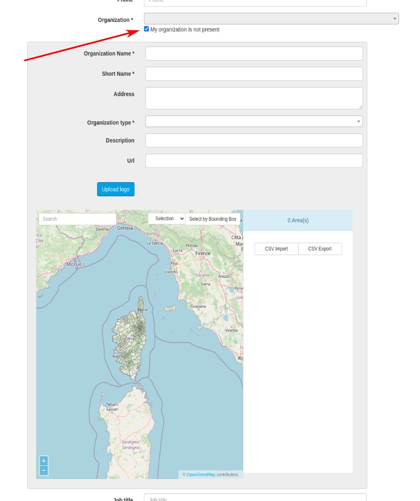
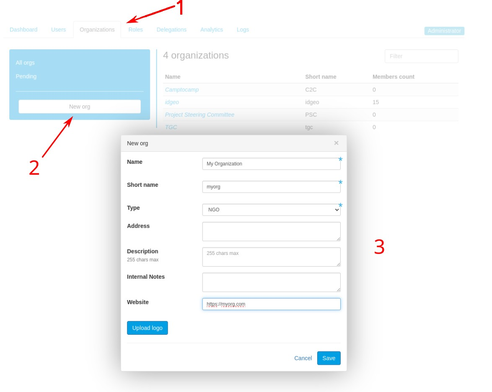

# Organizations

What organizations really represent might depend on your platform.  
They are entities used to organise people in groups that make sense in the context of your platform.

It is basically assumed that they will represent companies, NGOs, administrations, municipalities etc. Your employer, in a sense. But on some platforms, it may be decided to rather attach users to projects, for instance, or research units. 

## Users and organizations
A given user can be member of only one organization. This is a design choice.

But be reassured, roles will give you a lot of flexibility in access rights management. See [rights management page](../rights_management/index.md).

## Creation of a new organization
There are two scenarios where an organization can be created:

- When someone is registering a new account. If they don't find a matching organization, they can require the creation of a new organization. In this event, the platform's administrators will be informed by email and asked to validate (or not) the new organization.

- A platform administrator can create a new organization from the console admin panel.

### Area of competence

You can select on a map the entities on which the organization is active/ has a competence.

This is a concept that is used on several applications, but not all.  
Some applications will use this information to filter some privileged accesses. Please see [rights management page](../rights_management/index.md).
