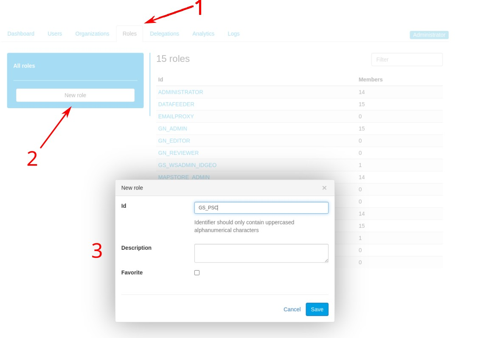
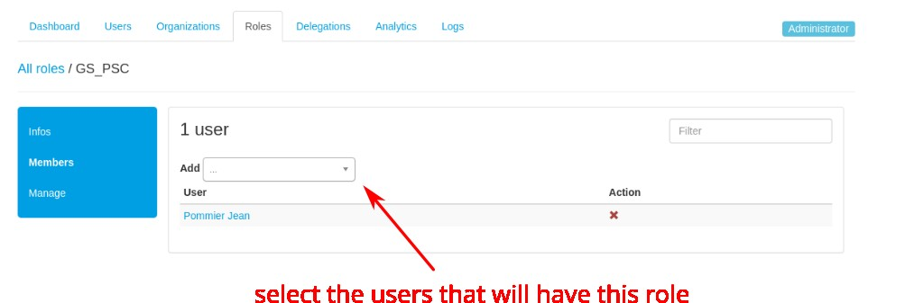

# Roles

Roles' purpose is to associate users with some permissions in the apps. Users are assigned some roles. And the apps are configured to grant users some permissions based on those roles.

At the core, a role is just a label, stored in the LDAP registry. A role gets useful when an application aknowledges its existence and configures some logic based on the user's belonging or not to that role.

Example: if you assign the `ADMINISTRATOR` and the `GN_EDITOR` to a user, this one will granted
- admin profile on GeoServer
- editor profile on GeoNetwork

## Core roles
On a brand new geOrchestra instance, some core roles are defined and are already used by the applications.

The roles:

 * ```SUPERUSER``` grants access to the console webapp (where one can manage users and roles),
 * ```ADMINISTRATOR``` is for GeoServer administrators,
 * ```GN_ADMIN``` is for GeoNetwork administrators,
 * ```GN_EDITOR``` is for metadata editors,
 * ```GN_REVIEWER``` is for metadata reviewers,
 * ```MAPSTORE_ADMIN``` is for MapStore administrators,
 * ```REFERENT``` allows users to edit their own organisation (basic information only),
 * ```EMAILPROXY``` allows to use the emailProxy webservice from the console,
 * ```IMPORT``` allows users to publish data with the importer application (also called datafeeder),
 * ```ORGADMIN``` is automatically granted to all users holding an admin delegation,
 * ```USER``` is for the basic SDI users.

Other roles can be defined by the platform administrator, using the console (or directly in the LDAP registry).

## Roles delegation
TODO

## Using additional roles

### 1. Create a new role

A person having the `SUPERUSER` role has the capacity to create new roles. At this stage, a new role is just a label with a description (optional).

This is done on the console UI, role tab.



### 2. Assign a new role to a user

Then, it is possible to assign this new role to users. There are 2 ways to do it, on the console interface: 

- either on the user's profile, in the `roles` tab
- or in the console's roles tab: open the new role's configuration interface, in the `users` tab, you can select the users.



*Remark*: this second way is more handy when you want to assign the role to several users

### 3. Configure an application to use a new role

This is on a per-applications basis. Some applications are likely to make use of new roles, others not so much.

On the [Rights management](rights_management/index.md) section is a list of core applications that can use new roles and how to leverage it.

