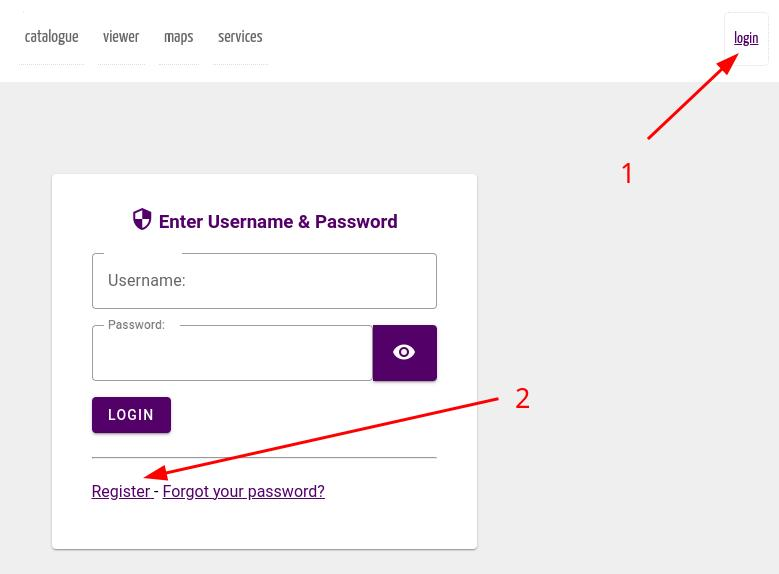
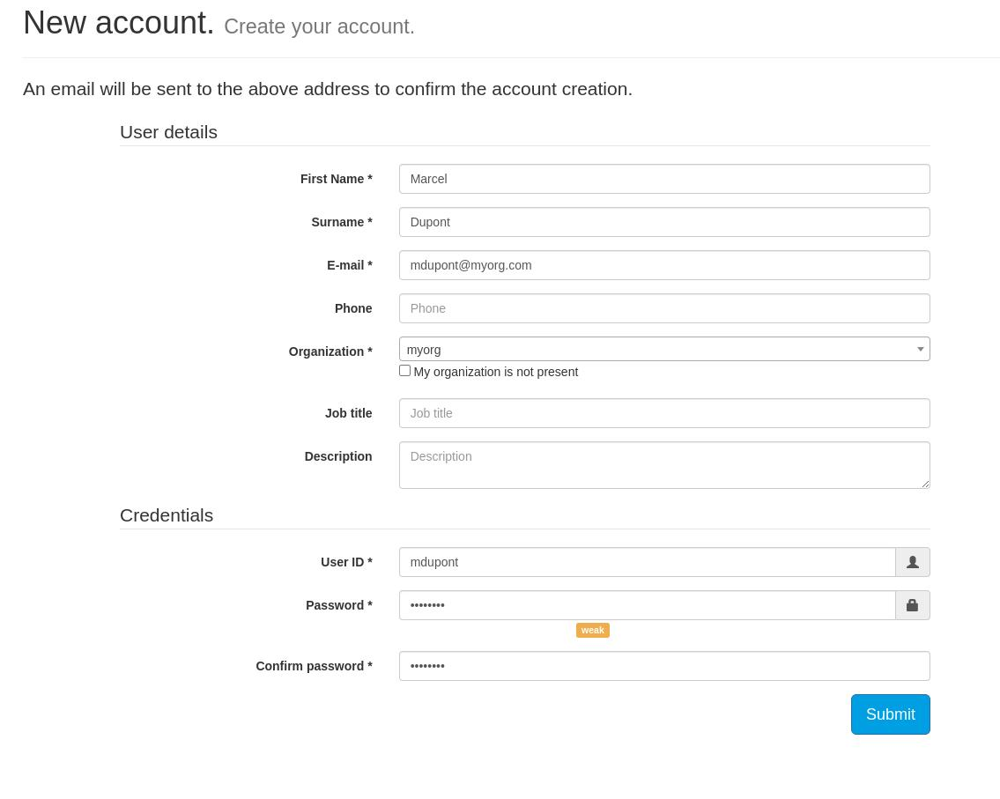
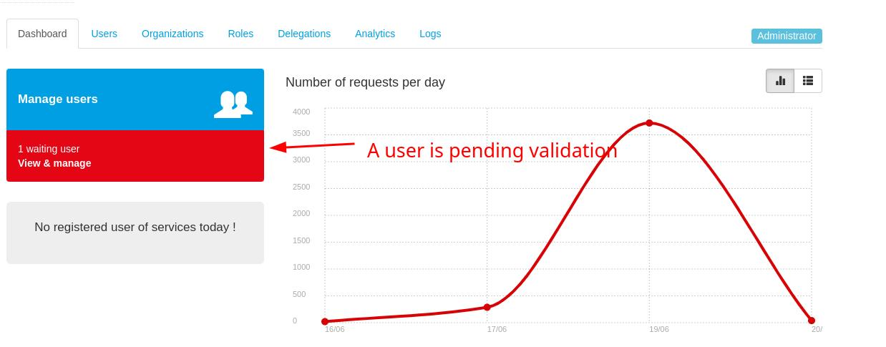
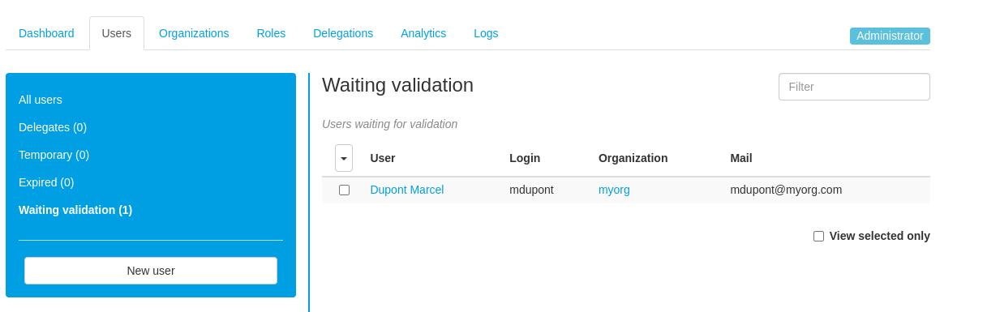
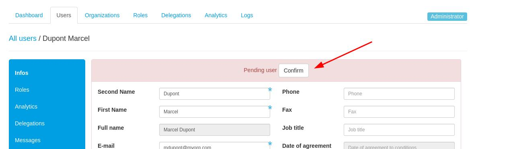
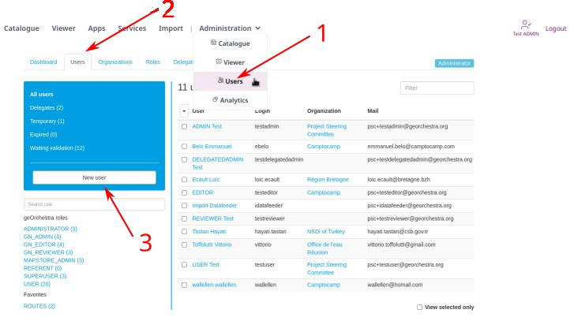
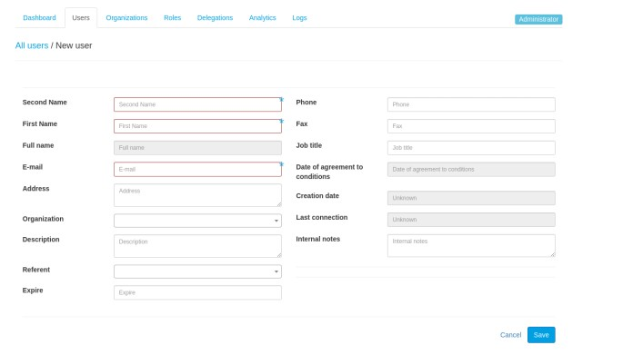

# Users

In order to access to functionalities beyond public consultation of the platform, you need to login using a user account. 
You may already have been provided with such an account by your platform administrator. Or you can ask for the creation of a new account.
On some platforms, you may also be offered the possibility to connect using an external identity provider like France Connect.

## Sample users

On a brand new deployment, these sample users have been automatically created:

 * ```testuser``` has the USER role. The password is **testuser**.
 * ```testreviewer``` has the USER & GN_REVIEWER roles. The password is **testreviewer**.
 * ```testeditor``` has the USER & GN_EDITOR roles. The password is **testeditor**.
 * ```testadmin``` has the USER, GN_ADMIN, ADMINISTRATOR and MOD_\* roles. The password is **testadmin**.
 * ```testdelegatedadmin``` has the USER role. Is able to grant the EXTRACTORAPP & GN_EDITOR roles to members of the psc & c2c orgs. The password is **testdelegatedadmin**.
 * ```testpendinguser``` is inside the pending users organizational unit, which means an admin has to validate it. The password is **testpendinguser**.

***Please note that `test*` users should be deleted before going into production !***

## Creating a user

### Scenario 1: Self-registration
If your platform has enabled self-registration, a new user can create his own account and ask for its validation.



In the registration form, the user will be asked to select the organization he/she belongs to. Organization play an important role in geOrchestra for data management. 



You can select an existing organization or [ask for the creation of a new one](organizations.md).

On most platforms, your registration (and the organization creation) will be moderated, e.g. it will have to be validated by a platform administrator. You will receive emails keeping you informed of the creation steps, so ***this is important that you provide a valid email address***.

Validation is done by a platform administrator. The platform administrators are notified by email. An alert is also displayed on the user administration console mentioning that users are pending validation.








### Scenario 2 : A platform admin creates a new user in the console interface
If your platform has disabled self-registration, an existing user with admin rights in the console can create a new user:



User creation form:




Some fields are mandatory. Their list depend on the platform's configuration. By default, `the following fields are mandatory:

- First name
- Second name
- Email (this **must** be a valid email as the platform will use it to communicate with you)
- Password (some security constraints on the password strength may be activated, depending on the platform)
- Organization you belong to.

The created user will then receive an email informing him of the account creation and asking him to set a new password.

## Using an external identity provider

TODO

## Users on geOrchestra apps

geOrchestra is binding together several web applications, some of which are internal to the project, others external projects, integrated into geOrchestra. How users are managed depends on the platform we are talking about. 

Please consult the [access rights management documentation](../rights_management/index.md) to know more about how the applications leverage the users information.