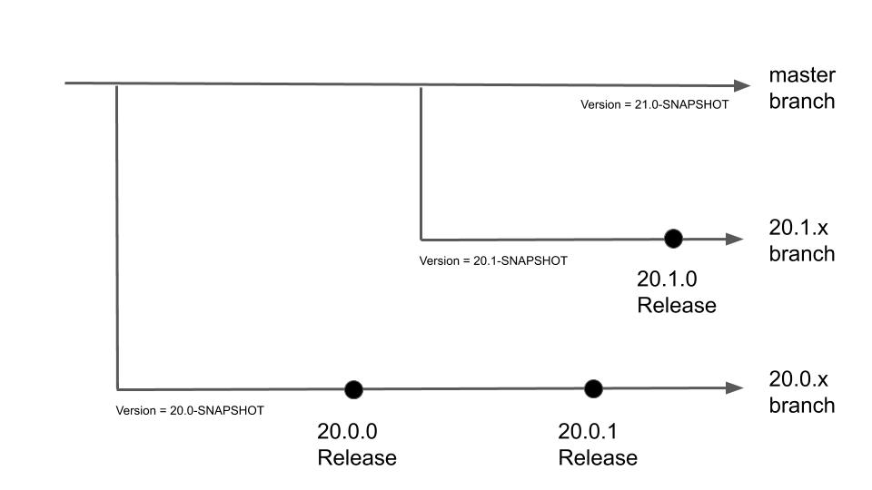

# Version Numbering Scheme

geOrchestra releases are named `YY.V.P` where:
 * `YY` are the latest two digits of the year (eg `20` for 2020)
 * `V` is an integer which represents the release index in the year (eg `0` for the first one, `1` for the second one)
 * `P` stands for the patch number

Upgrading from a version to another, which only differ by the patch number, does not require any configuration change, and is considered safe.

Upgrading from a major version `YY.V` to another one, like `YY.W` or `ZZ.*` requires a [migration process](https://github.com/georchestra/georchestra/blob/master/migrations).

## Branches, versions, tags

Patch releases use the same datadir branch name. For instance, versions 20.0.0 and 20.0.1 expect a [datadir branch 20.0](https://github.com/georchestra/datadir/tree/20.0)

# Applications that use georchestra core librairies

Some applications use georchestra core libraries, and are versioned with the following scheme. If a geoOrchestra major release is done and introduce a breaking change with the app, please create a major release of it also.

If the application is a fork of an existing application, it should contain another docker tag containing the version of the forked application.

# Forks versioning scheme

Forks in geOrchestra's must follow this scheme: 

|                       | Format                                                                             | Example                   |
|-----------------------|------------------------------------------------------------------------------------|---------------------------|
| Tag                   | `<upstream-version>-georchestra-<two-digit-georchestra-patch>`                     | 2.28.2-georchestra-00     |
| Release Candidate Tag | `<upstream-version>-georchestra-<two-digit-georchestra-patch>-<release_candidate>` | 2.28.2-georchestra-01-RC1 |
| Branch                | `<upstream-version>-georchestra`                                                   | 2.28.x-georchestra        |
