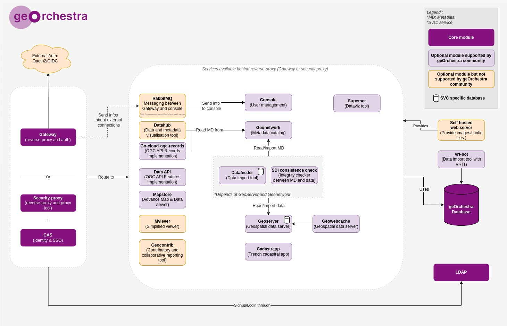

# Software architecture

## Routing and reverse proxy

Two components are used to route requests to the appropriate service:
- Gateway (more recent)
- Security proxy + cas (legacy)

Both components manage authentication and authorization.

### External authentication

External authentication is managed by the gateway.
Users are saved in the LDAP directory and are authenticated by the gateway to be able to manage permission for them within the geOrchestra's stack.

### RabbitMQ

RabbitMQ is used to send messages between the gateway and the console but is not mandatory.
It sends new external authentication information to the console, which is responsible for sending emails to administrators and logging it in the console's dashboard.

## Self hosted web server

The self-hosted web server is used to serve static files and to manage the console's configuration.
You can use apache, nginx, or any other web server to serve the static files like header configuration, css...

