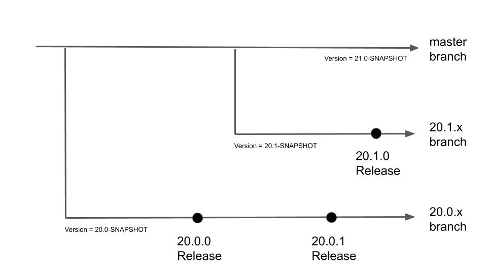

# Releases

## Version Numbering Scheme

geOrchestra releases are named `YY.V.P` where:
 * `YY` are the latest two digits of the year (eg `20` for 2020)
 * `V` is an integer which represents the release index in the year (eg `0` for the first one, `1` for the second one)
 * `P` stands for the patch number

Upgrading from a version to another, which only differ by the patch number, does not require any configuration change, and is considered safe.

Upgrading from a major version `YY.V` to another one, like `YY.W` or `ZZ.*` requires a [migration process](../migrations).

## Branches, versions, tags

Patch releases use the same datadir branch name. For instance, versions 20.0.0 and 20.0.1 expect a [datadir branch 20.0](https://github.com/georchestra/datadir/tree/20.0)
