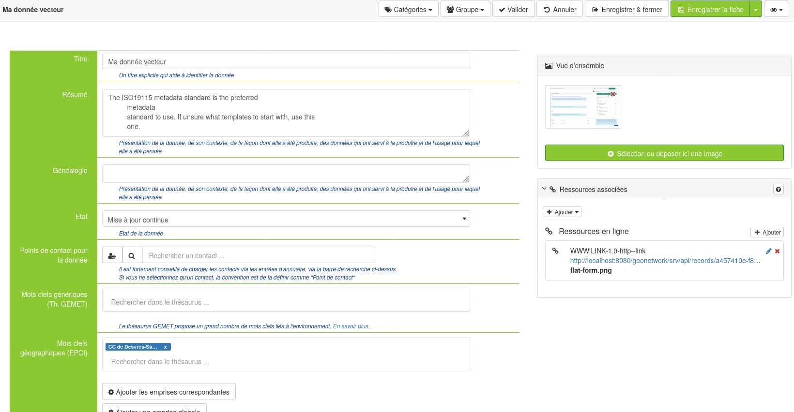
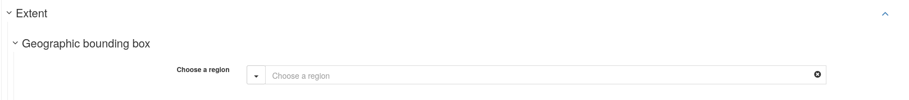

# Custom edition form in GeoNetwork

It is possible to use a custom edition form, for metadata edition, in GeoNetwork. Possible, and even [documented](https://geonetwork-opensource.org/manuals/4.0.x/en/customizing-application/editor-ui/creating-custom-editor.html), but not so simple.

This document is relying on a real use-case and showing how it was done.

Geo2france, a French region, asked for a simplified, flat form, close to what people are used to on platforms like CKAN.
- It would target ISO19139 metadata
- They wanted a limited number of fields.
- Thesauri would be pre-selected among a limited number of thesauri.
- the extent would be defined by selecting geo-keywords on a single thesaurus that would regroup all the extents on the territory
- If a user wanted to add additional fields, he would have to use the classic form editors (simple or advanced).
- And, of course, the form should behave correctly with existing records.

The expected result would look like this:
<!--  -->
<a href="gn_custom_form/visuel3.png"></a>

## Add an edition form

As documented in GeoNetwork's doc:
- it happens in the schema definition. So the new form will be tied to a given metadata schema.
- in the schema, it is defined in layout/config-editor.xml

You can add a *view*:
```xml
    <view name="g2f-flat-view"
          upAndDownControlHidden="true"
          displayTooltips="false"
          hideTimeInCalendar="true"
          class="geo2france-view ">
      <sidePanel>
        <directive data-gn-overview-manager=""/>
        <directive data-gn-onlinesrc-list=""
                   data-types="onlinesrc|parent|dataset|service|source|sibling|associated|fcats"/>
      </sidePanel>

      <tab id="flat-form" default="true" mode="flat">
        <section>        
<!-- here will go your field definitions -->
        </section>
      </tab>

      <flatModeExceptions>
        <for name="gmd:descriptiveKeywords" />
        <for name="gmd:status"/>
        <for name="gmd:pointOfContact"/>
        <for name="gmd:spatialResolution"/>
        <for name="gmd:denominator"/>
        <for name="gmd:geographicElement"/>
      </flatModeExceptions>
    </view>
```
Defining a class for your form will be very handy, as it can allow you to hack your way around stuff that were not designed for in the editor.

### Make it the default form

You will have to change the tab id to "default". And set another id for the current default form (simple view, on ISO 19139). Default form is determined in https://github.com/geonetwork/core-geonetwork/blob/main/web-ui/src/main/resources/catalog/js/edit/EditorController.js#L208-L231


### flatModeExceptions

They list the tags that GN will not try to "flatten", i.e. it will keep the complexity in their display. To keep interactive widgets like keyword selector, spatial resolution, point of contact selector, you have to not flatten them.

But in case you want a flat, aligned form, it will make things more complicated. Just saying.

### Add some fields
If you use the code above, you should get an empty form. Not very useful. So you'll want to add some fields.

#### Simple fields

In the `<section>` block above, you will add simple fields like the title and abstract

```xml
<field xpath="/gmd:MD_Metadata/gmd:identificationInfo/*/gmd:citation/*/gmd:title"/>

<field xpath="/gmd:MD_Metadata/gmd:identificationInfo/*/gmd:abstract"/>
```
If you want to override the fields' names, you can define a `name` attribute:

```xml
<field name="g2f-title"
       xpath="/gmd:MD_Metadata/gmd:identificationInfo/*/gmd:citation/*/gmd:title"/>
```
and add a corresponding string definition in your schema, in loc/[lang]/strings.xml

#### Add textual information below the field

You can also add some help information by using the `text` tag:

```xml
<text ref="g2f-title-help"/>
```
and add a corresponding string definition in your schema, in loc/[lang]/strings.xml
This is particularly interesting because you are allowed to use HTML content in `text` tags. This will be used later to hack our way through, to get the layout shon above.
For instance, the title-help could look like
```xml
 <g2f-title-help>
  <div class="row field-helper">
    <div class="col-sm-2"></div>
    <div class="col-sm-10">Un titre explicite qui aide à identifier la donnée</div>
  </div>
</g2f-title-help>
```

#### Add a button if the field is not already present in the model/metadata record
When editing a metadata record, it will happen that one of the fields that you want to display is not already present in the record. You can then configure your field to display an `add` button, that will add the xml snippet in the record
For instance, for the gmd:status field, it would look like:
```xml          
<field xpath="/gmd:MD_Metadata/gmd:identificationInfo/*/gmd:status"
       or="status"
        in="/gmd:MD_Metadata/gmd:identificationInfo/*"
        if="count(/gmd:MD_Metadata/gmd:identificationInfo/*/gmd:status) = 0"
/>

```


#### Add the PointofContact block
```xml

<field xpath="/gmd:MD_Metadata/gmd:identificationInfo/*/gmd:pointOfContact"
       or="pointOfContact" in="/gmd:MD_Metadata/gmd:identificationInfo/*"/>
```
but you won't be able to override easily the name of the block if you want to.
The way I found was to add a `<text ref="g2f-label-override-poc"/>` tag and do some heavy css hack.

#### Add a selector for a single, fixed, thesaurus

You can, in the field's xpath expression, select a single thesaurus: the selector widget will then restrict to a given thesaurus. For instance, with GEMET, it would look like
```xml
<field xpath="/gmd:MD_Metadata/gmd:identificationInfo/*/gmd:descriptiveKeywords[*/gmd:thesaurusName/*/gmd:title/*/text() = 'GEMET']"/>
```
But if you want to show a button in the case where the GEMET thesaurus was not present in an existing record, it will need a stronger configuration: you can use an `action` tag of type `add`, that will, if the button is clicked, insert an XML snippet in the record:
```xml
<field xpath="/gmd:MD_Metadata/gmd:identificationInfo/*/gmd:descriptiveKeywords[*/gmd:thesaurusName/*/gmd:title/*/text() = 'GEMET']"/>

<action type="add" btnLabel="g2f-add-keyword"
        if="count(/gmd:MD_Metadata/gmd:identificationInfo/*/gmd:descriptiveKeywords[*/gmd:thesaurusName/*/gmd:title/*/text() = 'GEMET']) = 0"
        or="descriptiveKeywords"
        in="/gmd:MD_Metadata/gmd:identificationInfo/*">
  <template>
    <snippet>
      <gmd:descriptiveKeywords>
        <gmd:MD_Keywords>
          <gmd:type>
            <gmd:MD_KeywordTypeCode codeList="http://standards.iso.org/iso/19139/resources/gmxCodelists.xml#MD_KeywordTypeCode"
                                    codeListValue="theme"/>
          </gmd:type>
          <gmd:thesaurusName>
            <gmd:CI_Citation>
              <gmd:title>
                <gmx:Anchor xlink:href="http://geonetwork-opensource.org/gemet">GEMET</gmx:Anchor>
              </gmd:title>
              <gmd:date>
                <gmd:CI_Date>
                  <gmd:date>
                    <gco:Date>2018-08-16</gco:Date>
                  </gmd:date>
                  <gmd:dateType>
                    <gmd:CI_DateTypeCode codeList="http://standards.iso.org/iso/19139/resources/gmxCodelists.xml#CI_DateTypeCode"
                                         codeListValue="publication"/>
                  </gmd:dateType>
                </gmd:CI_Date>
              </gmd:date>
              <gmd:identifier>
                <gmd:MD_Identifier>
                  <gmd:code>
                    <gmx:Anchor xlink:href="http://localhost:8080/geonetwork/srv/api/registries/vocabularies/external.theme.gemet">geonetwork.thesaurus.external.theme.gemet</gmx:Anchor>
                  </gmd:code>
                </gmd:MD_Identifier>
              </gmd:identifier>
            </gmd:CI_Citation>
          </gmd:thesaurusName>
        </gmd:MD_Keywords>
      </gmd:descriptiveKeywords>
    </snippet>
  </template>
</action>
```

## Style the edition form
Make it *not* look like another GN edition form is not that easy. Some things are hardcoded and not that much configurable. For instance, to get the point of contact block behave as expected in this use case, it was not easy.

### Override field labels
Thesauri labels, for instance, are not translated, so you might want to override them. I used the `text` tag for this, to insert some HTML. And then, hacked some css on top of it

In config-editor.xml:
```xml
<text ref="g2f-label-override-gemet"/>
```

In strings.xml:
```xml
<g2f-label-override-gemet>
  <div class="label-override">
    <div class="col-sm-2 newlabel">Generic keywords (Th. GEMET)</div>
  </div>
</g2f-label-override-gemet>
```

In web-ui/main/resources/catalog/views/default/less/gn_editor_default.less:
```xml
form.geo2france-view {
  ...

  // override a label (thesaurus fields)
  .label-override div.newlabel,
  .gn-field > label.control-label {
    clear:left;
    float:left;
    text-align: right;
    font-weight: bold;
    font-size: 14px;
    color: white;
    //line-height: 40px;
    //vertical-align:middle;
    //display:inline;
  }
  // and hide base label
  .label-override + div[data-gn-keyword-selector] label.control-label,
  .label-override + div.gn-add-field label.control-label
  {
    display: none;
  }

  ...
}
```

Some hacks were more complicated than others (e.g. point of contact block, or geographic extent's label)

## Get a 2 column display

I first requires *not to* use the `gn-label-above-input` class for your view.

Then, I once again used a `text` tag to introduce some HTML and then style them:
```xml
<text ref="g2f-bg"/>
```
and in loc/[lang]/strings.xml:
```xml
  <g2f-bg>
    <div class="bg">
      <div class="col-sm-2 light-bg"></div>
      <div class="col-sm-10 no-bg"></div>
    </div>
  </g2f-bg>
```
and some styling.


## Use a geo-thesaurus to define the extent

### Generate the thesaurus

The thesaurus was expected to contain entries for all administrative levels:
- region
- departments
- EPCI (inter-communalities)
- municipalities
- PNR (regional natural parcs)
- SCOT (land use planning)

We had a geopackage containing the geospatial features.
To collect them, get the envelopes and combine them all in a single thesaurus, I wrote a tool, [vrt2rdf](https://github.com/pi-geosolutions/vrt2rdf): it uses
- a vector VRT to configure the inputs. It provides a lot of flexibility in how to retrieve the data, and abstract away a lot of the specificities about the input formats
- a short python script retrieves all the features into a list
- the list is then applied to a jinja2 template, which gives a lot of flexibility on the output side of it.

### Add the thesaurus in GN
You will have to add it, in the thesaurus configuration page, in the admin console. Don't forget to import it as a **Place** thesaurus

### Add it in the form

I then added a selector on this thesaurus:
```xml
<field xpath="/gmd:MD_Metadata/gmd:identificationInfo/*/gmd:descriptiveKeywords[*/gmd:thesaurusName/*/gmd:title/*/text() = 'Territoires']"/>
```
And the buttons underneath it will allow you, once you have selected one or more keywords, to set the extent based on the keywords

### Have this thesaurus available in the extent block
In the extent block, you have a form field allowing to 'choose a region', either from geonames or from a few lists of very large entities (countries, oceans, etc).

Those large entities are taken from the `regions.rdf` thesaurus. Most of the time, for regional platforms, it won't be of any use.

If you want, you can replace it by your geo-thesaurus. Unfortunately at the time of writing this, the name of the thesaurus is hardcoded, so you will have to rename or import a second time your thesaurus under the name `regions.rdf` to get it available on this widget.


## Resources

Here are the resulting files:
- [config-editor.xml](gn_custom_form/config-editor.xml)
- [strings.xml](gn_custom_form/strings.xml)
- [gn_editor_default.less](gn_custom_form/gn_editor_default.less)
