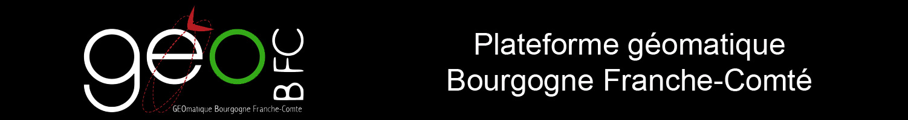
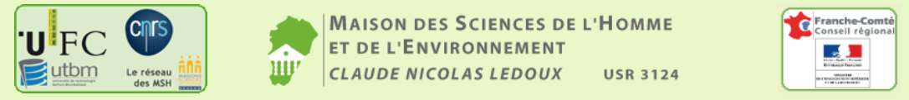

Ge@Sync was originally created in 2015 by Alexandre Maindron and Martin Tovmassian  (engineers at Maison des Sciences de l’Homme et de l’Environnement C. N. Ledoux,  from octobre 2014 to june 2015).

    Alexandre MAINDRON <alexandre@exmackina.com>
    Martin TOVMASSIAN <martin.tovmassian@gmail.com>

The code is currently written and maintened by Sophie Mollard. She is engineer at Maison des Sciences de l’Homme et de l’environnement C. N. Ledoux, since septembre 2015.

    Sophie MOLLARD <sophie.mollard@univ-fcomte.fr>

Ernest Chiarello is the project manager ; he is member of the research laboratory [ThéMA](http://thema.univ-fcomte.fr/).

    Ernest CHIARELLO <ernest.chiarello@univ-fcomte.fr>

The project is funded by the Maison des Sciences de l’Homme et de l’environnement C. N. Ledoux, [MSHE Ledoux - Besançon](http://mshe.univ-fcomte.fr), USR3124 "CNRS - University of Franche Comte" and was initiated within the framework of the [ODIT](http://odit.hypotheses.org/) project supported by European Union and the Region of Franche-Comte..

