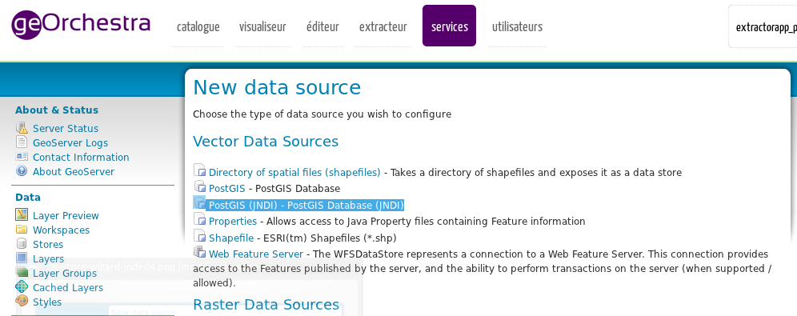
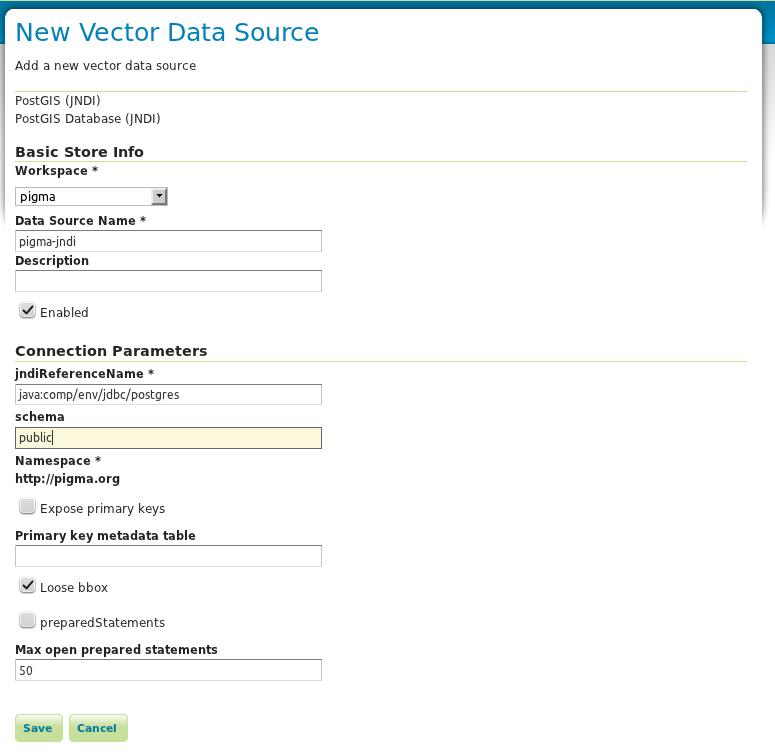
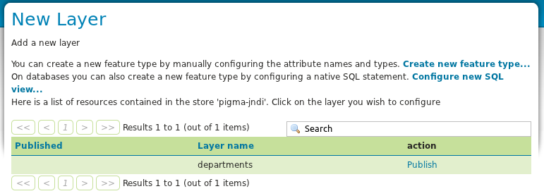

.. _adv_cookbook_datastore_jndi_connection_pool:

Configuring JNDI Connection Pool
================================

This document describes the steps required to setup Geoserver to use PostgresSQL through `JNDI Datasource <http://tomcat.apache.org/tomcat-6.0-doc/jndi-datasource-examples-howto.html>`_.

.. note:: The example described in this document was tested with Tomcat 9, Goeserver 2.1 and PostgresSQL 9.0.

.. _adv_cookbook_datastore_jndi_connection_pool_tomcat:

Tomcat Setup
------------
The **context.xml** file contains the different jndi resources configured for Tomcat. In this case, we are going to configure a **JNDI DataSource** for a **Postgres** database. 

The following example shows how the geoserver services can access to a spatial database called **pigma**, previously created in Postgres. All the details about the database are specified in the context file: url, username, password.
 

You should create a context file in **TOMCAT_HOME/conf/context.xml** with the following content:

context.xml
~~~~~~~~~~~

.. code-block:: xml 
   :linenos: 

      <Resource
	name="jdbc/postgres" auth="Container" type="javax.sql.DataSource"
	driverClassName="org.postgresql.Driver"
	url="jdbc:postgresql://127.0.0.1:5432/pigma"
	username="postgres" password="admin"
	maxActive="20" maxIdle="10" maxWait="-1"/>

.. _adv_cookbook_datastore_jndi_connection_pool_geoserver:

Geoserver Setup
---------------
Now, edit the Tomcat configuration in order to add the reference to the available resource in the context configuration.

To do that, open the **TOMCAT/webapp/geoserver/WEB-INF/web.xml** to write the following lines:

web.xml
~~~~~~~

.. code-block:: xml 
   :linenos: 

      <resource-ref>
         <description>Postgis Datasource</description>
         <res-ref-name>jdbc/postgres</res-ref-name>
         <res-type>javax.sql.DataSource</res-type>
         <res-auth>Container</res-auth>
      </resource-ref>
   
.. _adv_cookbook_datastore_jndi_connection_pool_datastore:

Adding a PostGIS(JNDI) Data Source
----------------------------------

When you restart Geoserver the JNDI will be available. Then, select the *Store > Add new Store* configuration

In this page, select the option **PostGIS (JNDI) - PostGIS Database (JNDI)**

Geoserver will show the form presented in the following figure. Fill the fields taking in to account that the **jndiReferenceName** field must contian the name configured in the **web.xml** in the **<res-ref-name>** element, that is **java:comp/env/jdbc/postgres**

**Save** the form. If all was OK, the New Layer form will be presented with the list of layer available to publish.

.. _adv_cookbook_datastore_jndi_connection_pool_references:

References
----------
You can found additional information in the following links.

#. `Apache Tomcat 6.0 JNDI Datasource HOW-TO <http://tomcat.apache.org/tomcat-6.0-doc/jndi-datasource-examples-howto.html>`_
#. `Setting up a JNDI connection pool with Tomcat <http://docs.geoserver.org/stable/en/user/tutorials/tomcat-jndi/tomcat-jndi.html>`_
#. `JDBC Driver <http://jdbc.postgresql.org/download.html>`_

.. mauricio at phung.fr 2012/05/15 