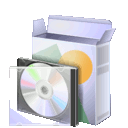

.. _`georchestra.documentation.index`:

===============
Documentation
===============

Cette section rassemble la documentation autour du projet geOrchestra. Vous 
pouvez télécahrger la documentation en un seul fichier PDF : 
`georchestra.pdf <georchestra.pdf>`_

Gouvernance
==============

.. toctree::
   :maxdepth: 1
   
   psc
   rfc

Les RFC proposées, discutées et votées sont disponible dans la section `RFC dans
le wiki <http://csm-bretagne.fr/redmine/projects/georchestra/wiki/RFC>`_ de la 
forge.

Présentation
=============

.. toctree::
   :maxdepth: 1
   
   overview
   feature

Installation
=============

.. toctree::
   :maxdepth: 1
   
   installation_fr
   security

Une documentation en français est en cours de rédaction, contactez nous si vous désirez y 
contribuer !

Utilisation
============

Une documentation est en cours de transposition sur le site, contactez nous si vous désirez y 
contribuer !

Administrateur
---------------

.. toctree::
   :maxdepth: 2

   administrateur/index

Utilisateur
------------

.. toctree::
   :maxdepth: 2
   
   utilisateur/index
   
   
F.A.Q.
========

.. toctree::
   :maxdepth: 3
   
   faq

