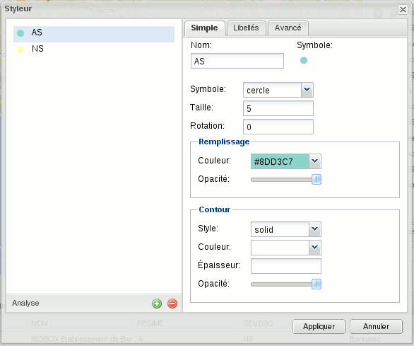
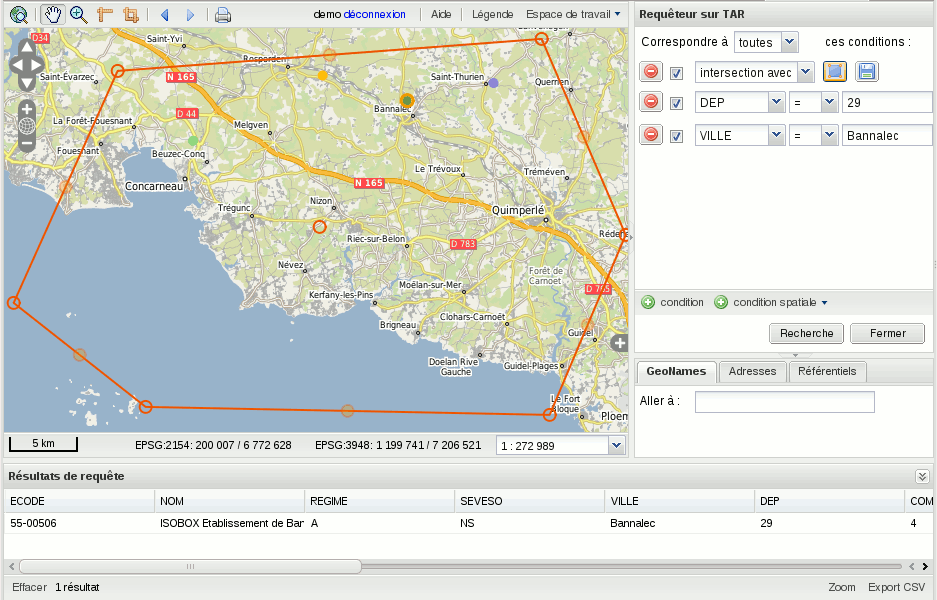
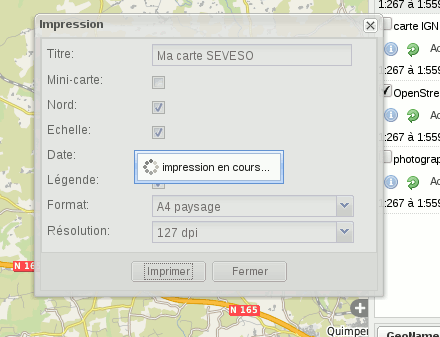
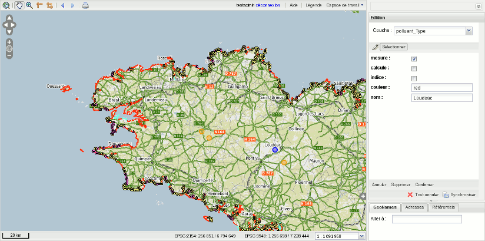
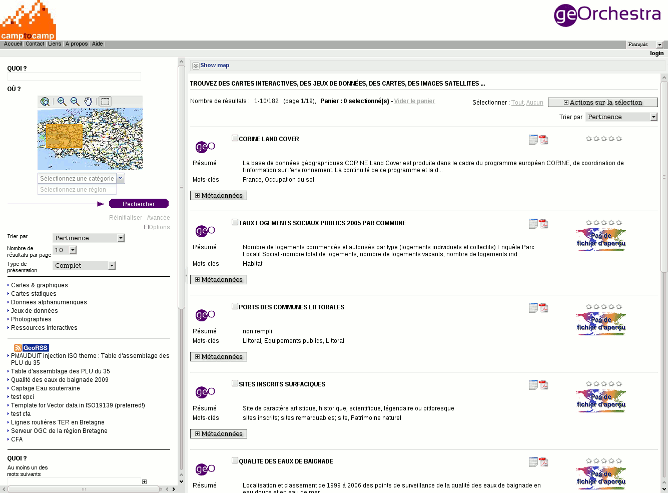

.. _`georchestra.documentation.overview`:

============================
Aperçu des fonctionnalités
============================

Pour une liste des fonctionnalités plus exhaustive, allez sur la page :ref:`georchestra.documentation.feature`.

Architecture
============

L'approche par modules
-----------------------

L'architecture de geOrchestra est composée de plusieurs modules autonomes.
Une implémentation geOrchestra peut ainsi évoluer en douceur : commencer par le 
serveur cartographique, puis comporter un ou plusieurs visualiseurs... Jusqu'à 
former un ensemble complet.

Le respect des normes
---------------------

Les modules respectent les normes OGC préconisées par INSPIRE. Toutes les 
interactions entre modules utilisent ces normes : le système peut ainsi interopérer 
avec d'autres systèmes répondant aux mêmes normes, mais il est aussi lui-même 
interopérable en interne, et peut aisément s'adjoindre les fonctions d'un composant 
externe.
Vous pouvez par exemple utiliser QGIS ou ArcGIS pour fabriquer les symbolisations 
de cartes, puis exporter ce travail dans geOrchestra.

Le suivi de la charge
---------------------

Geoserver est utilisé dans des installations subissant de très fortes charges. 
Son intégration native du tuilage lui permet de répondre aux fortes sollicitations
ou peut servir des couches très volumineuses.

Visualiseur
===========

Le visualiseur geOrchestra est un module autonome de consultation de cartes sur 
internet. Depuis un navigateur web, le visualiseur permet de rechercher, de charger,
de consulter ces cartes. Le visualiseur fonctionne sur les versions récentes de 
Firefox, Internet Explorer, Opera, Chrome, Safari.

.. image:: _static/georchestra_viewer.png

Depuis l'interface du visualiseur, l'utilisateur peut parcourir des catalogues 
de données respectant les normes INSPIRE, prendre connaissance du contenu des données
(source, millésime, validité, droits...) en consultant les fiches associées, 
avant de les charger sur la carte.

Il peut aussi interroger directement les serveurs "WMS" dont il connaît l'adresse, 
ou enfin utiliser les serveurs déjà référencés par le visualiseur. 

L'interface est conçue pour travailler sur toutes tailles d'écran. Les panneaux 
latéraux repliables offrent une surface de visualisation maximale sur de petits 
écrans, alors que le chargement par tuiles optimise l'affichage sur de grands 
écrans.

.. note::
    Les configurations de cartes sont enregistrées dans des documents très légers 
    appelés "contextes" qui peuvent être rechargés, modifiés, échangés avec des tiers.

    Le visualiseur peut être inséré dans un site existant. Sa configuration de 
    démarrage est personnalisable par l'administrateur du site :
    données chargées par défaut, projection, emprise, catalogue et serveurs ciblés, 
    performance des navigateurs...

Styleur
---------

Le styleur est une fonction avancée du visualiseur pour personnaliser les cartes 
selon les attentes précises de l'utilisateur.
Il permet en effet d'établir des règles de représentation (forme, couleur, 
transparence, police) en fonction des données : par exemple,
représenter les éléments de type "forêt" en vert et ne pas afficher ceux de type 
"urbanisé", ou mettre en relief les "parcelles de moins de 500m2".
Le styleur ne télécharge aucune donnée : les serveurs font le travail. Il peut 
travailler sur des données très volumineuses comme le cadastre avec le même niveau
de performance.

.. note::
    Les styles fabriqués peuvent être conservés ou échangés avec des tiers. 
    L'utilisateur peut ainsi construire sa propre bibliothèque de cartes
    correspondant à ses besoins.

Requêteur
----------

À la différence du styleur, le requêteur télécharge les données dans le 
navigateur pour les représenter, 
afficher tous les attributs dans un tableau et, si souhaité, les exporter vers 
un tableur. Le requêteur procède par filtres 
géographiques (par exemple : intersection avec points, lignes, polygones tracés 
par l'utilisateur) et attributaires
(par exemple : valeur comprise entre deux nombres) que l'on modifie jusqu'à 
obtenir le résultat souhaité.

Impression
-----------

La fonction d'impression insère la carte dans un document PDF selon des gabarits 
préfabriqués.

Éditeur
---------

L'éditeur utilise la norme WFS-T (pour Transactionnel) pour permettre à 
l'utilisateur de modifier en direct les objets composant la carte. Il est 
possible de saisir et modifier des informations en ligne : un périmètre 
d'étude avec sa description, un document existant que l'on souhaite
localiser, un tracé de projet... La fonction d'édition est une base de 
construction pour des cartes collaboratives.

Catalogue
==========

Le catalogue référence et décrit les données. Respectant les normes INSPIRE, le 
catalogue est un point d'entrée important par lequel l'utilisateur
prend connaissance du patrimoine de données, recherche par thématique ou mots 
clefs les lots disponibles, et les soumets aux autres modules pour
visualisation ou extraction. Le catalogue est basé sur Geonetwork, l'outil de 
référence pour la norme d'interrogation de catalogues CSW. 

Extracteur
===========

L'extracteur est un module autonome permettant le téléchargement de données pour 
utilisation dans des logiciels tiers. En délimitant un secteur géographique,
en choisissant une sélection de données, un format et une projection, on obtient 
un lot de données personnalisé. Cette opération étant souvent longue,
l'extracteur émet un message à la fin du travail pour signaler que le 
téléchargement est prêt.

.. image:: _static/georchestra_extractorapp.png

Serveur Cartographique
=======================

Le serveur cartographique de geOrchestra est Geoserver, un puissant outil de 
publication aux normes INSPIRE. Equipé d'une interface graphique francisée,
Geoserver offre à l'administrateur de données un contrôle fin sur tous les 
aspects de la publication : description des couches, formats de sortie, droits d'accès, 
styles... Si le format de prédilection des données est SHAPE, Geoserver sait 
composer avec de nombreuses autres sources de données et peut donc 
s'intégrer à des systèmes d'information existants. 

Geoserver propose de plus un Web Processing Service, un service de traitement de 
données puissant aux capacités comparables aux systèmes d'information géographique. 

Geopublisher
=============

Le geopublisher est un outil de productivité pour l'administateur de données : 
il coordonne la description des données dans le catalogue
avec leur publication sur les services de données. Le geopublisher permet une 
publication rapide des lots de données simples.

