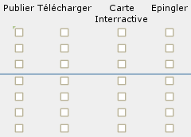

.. _`georchestra.documentation.security`:

==================================
Gestion des droits et sécurité
==================================

Introduction
=============

La mise en place de droit d'accès est fondamentale au sein d'une Infrastructure 
de Données Spatiales. Cette page a pour objectif d'expliquer son fonctionnement 
au sein de geOrchestra.

La première partie décrit les interfaces de gestion des accès en fonction de 
l'outil utilisé. La section suivante illustre le concept de groupe et de région 
au sein de geOrchestra.

Vous pouvez accéder à la page :ref:`georchestra.documentation.installation_fr` 
pour d'autres informations à ce sujet.

Gestion
=========

Catalogue
----------

Principes
.........

La gestion de droits du catalogue permet d'attribuer à des groupes d'utilisateurs
des permissions sur les métadonnées. Dans le catalogue, on appelle ces
permissions des *privilèges*.

- le privilège ``Publier`` autorise la consultation de la fiche par l'interface
  ou par le protocole CSW . Associé au groupe spécial ``Tous``, 
  ce privilège autorise tout public à consulter la métadonnée.

- le privilège ``Télécharger`` autorise le téléchargement des données.
  Une section ``Options de transfert`` apparaît dans la fiche avec un lien
  de téléchargement.

- le privilège ``Carte interactive`` autorise le chargement des données 
  sur la carte interactive du catalogue. Une section ``Options de transfert`` 
  apparaît dans la fiche avec un lien ``Carte interactive``.

Pour résoudre les privilèges d'un utilisateur, les règles suivantes sont appliquées :

- les administrateurs du catalogue ont bien évidemment tous les privilèges,
- un auteur reçoit automatiquement tous les privilèges sur les fiches qu'il a 
  produites,
- un utilisateur reçoit les privilèges attribués à ses groupes.

Interface
.........

Les privilèges peuvent être appliqués à une unique fiche avec le menu 
|autres_actions| ou, après recherche de fiches, à un ensemble de fiches
avec le menu |action_selection|.

L'interface de gestion des privilèges se présente sous la forme d'une matrice 
avec les groupes en ligne et les privilèges en colonne. En cochant une case, 
on attribue à un groupe   le privilège lui permettant d'effectuer une action. 
On peut cocher autant de cases que souhaité.

Serveur cartographique
-----------------------

 * via gssec pour GeoServer 1 :
 
   * **avantage :** 
   
    * permet de structurer les ACL en "groupes" pour ensuite en déléguer la gestion. 
    * Ne nécessite pas un compte administrateur geoserver. 
    * Requiert un accès système pour gérer les délégations.

   * **inconvénient :** 
   
    * ergonomie non adaptée à un grand nombre de couches ou de groupes. 
    * Stabilité à éprouver. 
    * Pas de nettoyage automatique pour les groupes/couches supprimés.

 * GeoServer 2 et supérieur :
   
   * **avantage :** 
   
     * intégré, stable, 
     * fonction de recherche adaptée à un grand nombre de couches, 
     * pas d'accès système nécessaire.

   * **inconvénient :** 
   
     * ne connaît pas la liste des groupes LDAP qui doivent être entrés comme 
       des mots clefs, pas de délégation possible. 
     * Pas de nettoyage automatique pour les groupes/couches supprimés.

Notion de groupe
=================

On peut comprendre les  groupes comme des "tags" que l'on applique à un utilisateur.

 * EL_* : groupe structurel (accès en fonction de la structure)
 * SV_* : groupe fonctionnel (accès en fonction des fonctionnalités, si j'ose dire)

.. note::
    Par défaut, toutes les couches peuvent être accéder en lecture, aucune ne 
    l'est en écriture.

Exemple de groupe structurel :

 * EL_C2C
 * EL_adherent
 * EL_nonadherent
 * EL_OSM
 * EL_BRETAGNE
 * EL_BREST

*user1* appartient à EL_C2C et EL_adherent. Par contre *user2* appartiendra à 
EL_C2C, EL_adherent et EL_OSM.

Exemple de groupe fonctionnel :

 * SV_ADMIN : big boss
 * SV_USER : peut s'authentifier
 * SV_EDITOR : édition du catalogue
 * SV_REVIEWOR : si l'organisme a des sous, des utilisateurs qui peuvent relire 
   les fiches de catalogues

.. Notez que SV_EDITOR donne des droits dans mapfishapp/editor mais cela n'est 
   pas cohérent car l'utilisateur a un accès en écriture en fonction de son 
   groupe structurel + des droits côté GS (soit via gssec, soit directement par GS2)

Notion de région
==================

Il s'agit plutôt de groupe d'ACL plutôt que de "région" au sens localisation. 
L'intérêt est de pouvoir permettre la  délégation de la gestion des ACL des 
couches à un utilisateur.

**Exemple :** 

L'utilisateur *user2* appartient au groupe EL_ADMIN_OSM, on créé un fichier de configuration
OSM.properties qui fait le lien entre le nom du groupe d'ACL et le groupe 
LDAP (EL_ADMIN_OSM par exemple) et cet utilisateur, après qu'on lui 
ait donné un droit sur une couche, pourra gérer les accès pour ses collègues. 
Il ne verra et pourra modifier que les acl au sein de ce groupe/région.
