.. _`georchestra.documentation.utilisateur.catalogue`:

==========================
Catalogue – mode d’emploi
==========================

:author: Lydie Vinsonneau

Introduction
============

Pour appréhender les potentialités du catalogue de geOrchestra, n’hésitez pas à 
cliquer sur la rubrique, parmi celles présentées qui vous intéressent :

 * :ref:`georchestra.documentation.utilisateur.catalogue.creer`
 * :ref:`georchestra.documentation.utilisateur.catalogue.saisir`
 * :ref:`georchestra.documentation.utilisateur.catalogue.importer`
 * :ref:`georchestra.documentation.utilisateur.catalogue.administrer`
 * :ref:`georchestra.documentation.utilisateur.catalogue.majfiche`
 * :ref:`georchestra.documentation.utilisateur.catalogue.majdonnees`

.. _`georchestra.documentation.utilisateur.catalogue.creer`:

Création d’une fiche
=====================

Après vous être connecté avec votre compte utilisateur, allez dans le menu 
administration → nouvelle métadonnée.

Puis, laissez par défaut le modèle "geOrchestra Inspire" et le groupe 
(votre structure) et cliquez sur *créer*. La fiche est maintenant créée :

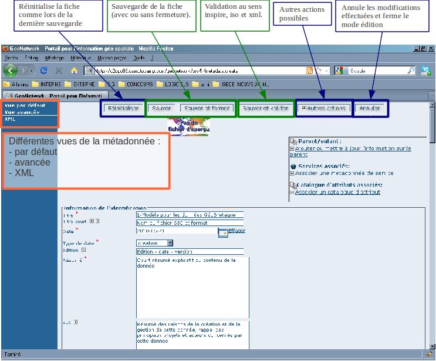

**Règles générales :**

  * En cliquant sur le symbol plus, vous rajoutez dans la fiche un champ 
    identique à celui sur lequel vous cliquez.
  * En cliquant sur la croix, vous supprimez le champ de la vue actuelle. Vous 
    pouvez toujours le retrouver en allant dans la vue avancée associée à ce 
    champ (ISO Complet pour tout voir).
  * Ces boutons permettent de changer l’ordre des champs.

.. note::
        Si vous voulez ajouter un champ non présent dans le modèle, il vous 
        suffira d’allez dans la vue avancée associée à votre champ (ISO Complet 
        pour tout voir).

.. _`georchestra.documentation.utilisateur.catalogue.saisir`:

Saisie d’une fiche
===================

Nous allons ici détailler les différents champs à remplir (les champs notés avec 
une étoile rouge sont obligatoires).

**Identification :**

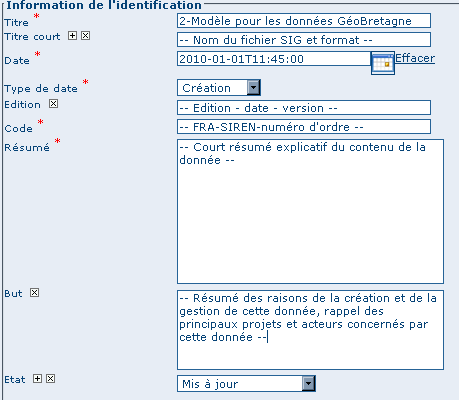

* **Titre :** Il s'agit du titre littéral de la donnée. Il doit être clair et 
  compréhensible par une personne n'ayant pas de connaissance particulière dans 
  le domaine inhérent à cette donnée. Il devra comprendre la mention de l’entité 
  géographique couverte. Ne pas mettre d’articles au début (le, la, les, ...).
* **Titre court :** titre court de la donnée.
* **Date :** C'est une date de référence concernant la donnée. On privilègera 
  la date de validité à minima.
* **Code :** code de la forme : FR(code pays)-500-233-016(code siren du 
  producteur)-nom technique (à valider).
* **Résumé :** Un résumé du contenu de la donnée. Il devra être accessible au 
  grand public dans sa première partie et pourra être plus technique dans une 
  seconde partie. Il pourra expliquer les champs « clés » de la donnée.
* **But :** Il décrit le contexte de la création de la donnée, les objectifs de 
  la donnée et l’usage de la donnée qui a été fait après sa création.
* **Etat :** Etat de la donnée :
 
 - Obsolète : donnée ancienne sans mise à jour prévue.
 - Historique : donnée ancienne qui a été mise à jour depuis.
 - Mis à jour : donnée en cours de création.
 - Terminé (valeur par défaut): donnée à jour (la mise à jour a été effectuée).
 - En cours / requis / planifié : pas de définition exacte

**Point de contact :**

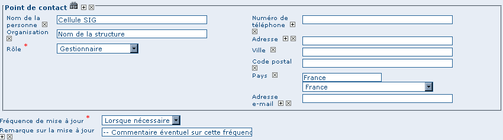

Après clic sur la jumelle, accès à la liste des contacts préalablement saisis. 
Une fois  la fenêtre ouverte, choisissez le contact puis cliquez sur *Ajouter*.

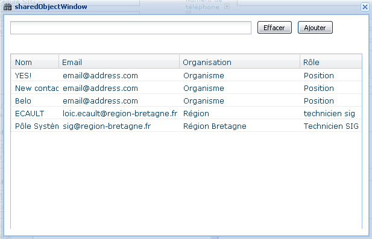

* **Point de contact :** Il s’agit du point de contact si l’on veut des 
  informations sur la donnée. Le nom de l’organisation, de la personne, le rôle 
  de la personne et l’adresse e-mail sont obligatoires.
* **Rôle :** On privilègera le rôle Gestionnaire qui correspondra soit au 
  service SIG de la structure ou au service interne de la structure qui gère la 
  donnée.
* **Organisation :** Saisir le nom complet de la structure (et non les 
  abréviations). Il devra commencer par une majuscule et ne pas comporter 
  d’accents (ex : Communaute de communes de la Roche aux fees).
* **Fréquence de mise à jour :** fréquence de mise à jour de la donnée. Quelques 
  précisions sur les valeurs non périodiques :
  
 - Continue : vrai dans le cas d’un capteur automatique qui met à jour la 
   donnée en temps réel.
 - Lorsque nécessaire : quand on sait que la donnée sera mise à jour à une date 
   non définie => valeur à privilégier par rapport à irrégulière ou inconnue.

* **Remarque sur la mise à jour :** Remarques éventuelles sur la fréquence de 
  mise à jour. Par exemple l’événement qui déclanche la mise à jour ou la date 
  de mise à jour.

**Mots clés :**

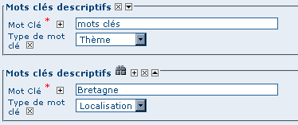

Lister les mots clés référents à la couche. Pour en rajouter, il faudra cliquer 
sur le symbol "plus" puis saisir les mots clés en minuscule. Les accents sont 
autorisés.

.. warning::
        Ne pas saisir les mots clés à la suite dans une même case. Utilisez le 
        symbol "+" pour ajouter autant de case que nécessaire.

Pour accèder au thésaurus (symbole jumelle) voyez la section suivante.

**Sélection de mots-clés via un thésaurus :**

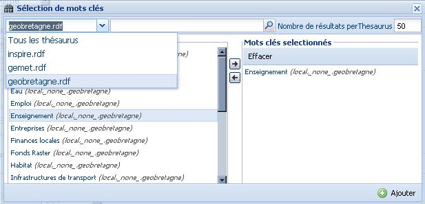

* **Choix du thésaurus (liste déroulante):** il est fortement conseillé d’avoir 
  au moins un mot-clé général et une autre GMET, par contre un seul mot-clé inspire.
* Pour sélectionner un mot-clé, double-cliquez sur le mot ou se servir des flèches.
* Pour finir, on clique sur Ajouter

**Conditions d’accès :**

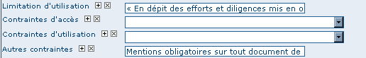

* **Limitation d’utilisation :** par défaut, éventuelle contrainte d'utilisation.
* **Contraintes d’accès :** Eventuelle contrainte d’accès à la donnée.
* **Contraintes d’utilisation :** Eventuelle contrainte d’utilisation de la donnée.
* **Autres contraintes :** Autres contraintes éventuelles comme la signification 
  sur toute carte de la source de la donnée.

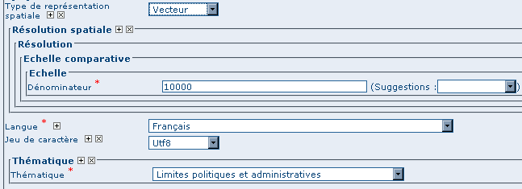

* **Type de représentation spatiale :** type de la donnée s’il s’agit d’un vecteur, raster, tableau…
* **Echelle :** Echelle de saisie de la donnée. (si inconnue, mettre l’échelle d’utilisation de la donnée).
* **Langue :** Langue de la donnée.
* **Jeu de caractère :** Type du jeu de caractère (par défaut UTF8).
* **Thématique :** Thème ISO à choisir dans la liste.

**Emprise :**

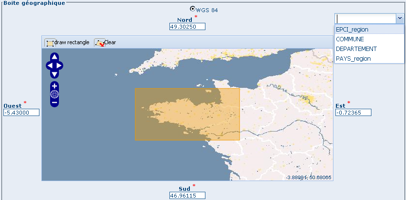

Pour saisir l’emprise de la donnée, plusieurs possibilités :

* Saisie « en dur » dans les zones de saisies (Nord, Sud, Est, Ouest).
* Saisie grâce aux couches référentielles :

 * Choix de la couche.
 * Saisie de l’entité sur laquelle portera l’emprise.

* Saisie grâce à la fonction draw rectangle

**Distributeur :**

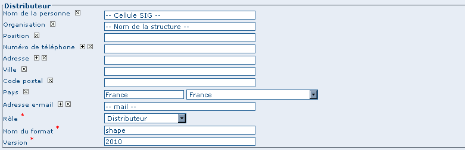

Informations diverses sur le **distributeur** de la donnée. Laissez le **rôle**
 distributeur. **Nom du format :** format de distribution de la donnée. Il 
 s’agira du format de la couche géographique vecteur (shape, table, mif/mid ...), 
 raster (ecw, tif, ...) ou autre. **Version :** version du format. Si la version 
 est inconnue, mettre l’année de sortie du logiciel producteur de la donnée.

**Transfert de la donnée :**

Attention, le fichier qui va être importé dans geobretagne doit être :

* Un fichier zip qui porte le même nom que le fichier shape qu’il contient.
* Le nom de la couche doit être de la forme donnee_structure_millesime (ex : 
  route_cg35_2010).
* Le fichier .prj devra être au format geoserver. Par exemple, pour la projection 
  Lambert 93, remplacer son contenu par les lignes suivantes :

::
        
        PROJCS["RGF93 / Lambert-93", GEOGCS["RGF93", DATUM["Reseau Geodesique Francais 1993", SPHEROID["GRS 1980", 6378137.0, 298.257222101, 
        AUTHORITY["EPSG","7019"]], TOWGS84[0.0, 0.0, 0.0, 0.0, 0.0, 0.0, 0.0], AUTHORITY["EPSG","6171"]], PRIMEM["Greenwich", 0.0, AUTHORITY
        ["EPSG","8901"]], UNIT["degree", 0.017453292519943295], AXIS["Geodetic longitude", EAST], AXIS["Geodetic latitude", NORTH], AUTHORITY
        ["EPSG","4171"]], PROJECTION["Lambert Conic Conformal (2SP)", AUTHORITY["EPSG","9802"]], PARAMETER["central_meridian", 3.0], PARAMETER
        ["latitude_of_origin", 46.5], PARAMETER["standard_parallel_1", 49.0], PARAMETER["false_easting", 700000.0], PARAMETER["false_northing",
         6600000.0], PARAMETER["standard_parallel_2", 44.0], UNIT["m", 1.0], AXIS["Easting", EAST], AXIS["Northing", NORTH], 
         AUTHORITY["EPSG","2154"]]

Ensuite, l’import de la donnée peut commencer :

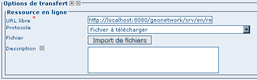

Cliquez sur le bouton "Import de fichier" pour pouvoir importer un lot de 
données dans geonetwork

La fenêtre d’import de fichier apparaît :

.. image:: _static/catalogue_saisir_import2.png

Cliquez sur parcourir pour sélectionner le fichier zip (contenant votre donnée 
géographique) puis cliquez sur téléchargement.
Un message s’affiche pour dire qu’il a été téléchargé avec succès, vous pouvez 
ensuite fermer la fenêtre.

**Publication OGC :**

Cliquez sur geopublisher pour accéder au menu de publication OGC :

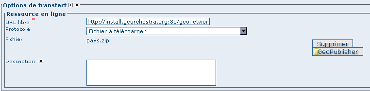

Puis réaliser les étapes suivantes :

* Choix du noeud (ici My preferred Geoserver node).
* Clic sur Vérifiez pour vérifiez que le jeu de donnée a été bien importée.
* Clic sur Publier pour faire la publication OGC de la couche.
* Clic sur Ajouter une source en ligne pour revenir à la fiche de métadonnées. 
  Le lien de publication sera effectif.

.. note ::
        S’il y a une erreur la première fois que vous cliquez sur publiez (ou 
        vérifiez), ne pas hésitez à recommencer.

**Système de référence :**

Cliquez ici pour accéder à la liste des projections :

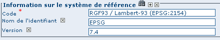

Sélection par type de système de coordonnées ou saisie en direct de la 
projection choisie :

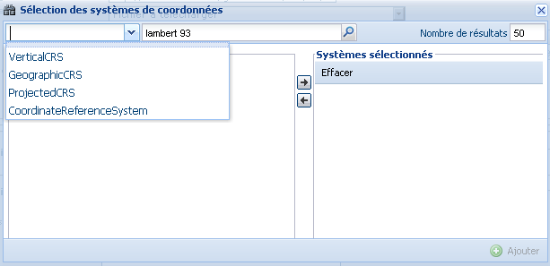

**Qualité de la donnée :**

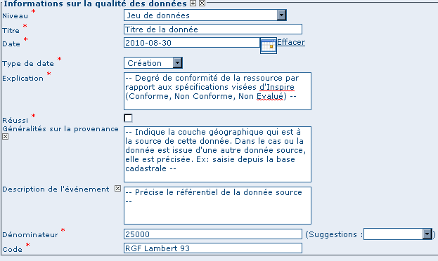

* **Niveau :** Par défaut, jeu de données qui correspond à un ensemble de 
  données de même type, dans une même couche ce qui sera la majorité des cas. 
  Le type collection de données correspondra à une métadonnée qui correspond à 
  plusieurs données (exemple de la BD_Carto).
* **Titre :** Nom de la spécification relative à la qualité de la donnée. Par 
  défaut, il s’agit de la spécification inspire.
* **Date/Type de date :** Date relative à la spécification (par défaut celle du 
  3/12/2008 relative aux fiches de métadonnées). On privilégiera le type de 
  date, date de publication.
* **Explication :** Degré de conformité de la ressource par rapport aux 
  spécifications visées d'Inspire (Conforme, Non Conforme, Non Evalué).
* **Réussi :** Cochez si la donnée est conforme à la norme INSPIRE.
* **Généralité sur la provenance :** Indique la couche géographique qui est à 
  la source de cette donnée. Dans le cas ou la donnée est issue d'une autre 
  donnée source, elle est précisée. Ex: saisie depuis la base cadastrale.
* **Description de l’événement :** Référentiel utilisé pour saisir la donnée.
* **Dénominateur :** Echelle de référence pour la numérisation.
* **Code :** informations sur la projection de la donnée source.

**Autres informations :**

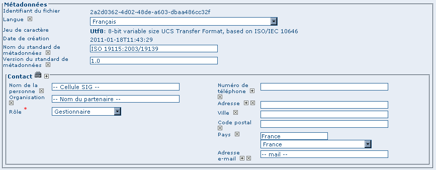

* **Langue :** langue de la fiche de métadonnée
* **Standard métadonnées ; version standard métadonnées :** A ne pas changer.
* **Contact :** Personne qui a saisi la fiche de métadonnées. On privilégiera 
  le rôle de gestionnaire de la fiche de métadonnée. Pour l’organisation, elle 
  devra commencer par une majuscule et ne pas comporter d’accents et de tirets. 
  (ex : Communaute de communes de la Roche aux fees).

**Aide complémentaire :**

* `Lien INSPIRE by clouds <http://georezo.net/wiki/main:donnees:inspire:aide_a_la_saisie_des_metadonnees_inspire?do=subscribe#identificateur_de_ressource_unique>`_ .
* `Manuel Geonetwork <http://csm-bretagne.fr/redmine/attachments/598/Manual_fra.pdf>`_ 

.. _`georchestra.documentation.utilisateur.catalogue.importer`:

Import d’une fiche
===================

Pour importer une fiche existante, aller dans le menu administration → import 
de fichiers XML.

.. image:: _static/catalogue_importer.png

* **Mode d’insertion :** Choix entre import le fichier ou de copier/coller le 
  contenu du fichier.
* **Type de fichier :** Format du fichier qui va être importé, le plus souvent 
  XML. MEF étant un format d’export spécifique à geonetwork.
* **Métadonnées :** Chemin d’accès à la fiche de métadonnées à importer.
* **Type :** Métadonnées (pour une simple métadonnée) ou Modèle (pour une 
  métadonnée qui servira de modèle aux futures saisies).
* **Action à l’import :** Actions à effectuer si la fiche est déjà présente 
  dans la base.
* **Feuille de style :** Conversion d’une métadonnée issue d’une autre norme.
* **Valider :** Validation OGC et INSPIRE de la fiche de métadonnées.
* **Catégorie :** Type de la donnée issu de la fiche de métadonnées (le plus 
  souvent Jeux de Données).

Une fois que vous avez saisi les paramètres voulu, cliquez sur insérer. Un 
message de ce type vous préviendra que la fiche de métadonnées a été insérée :

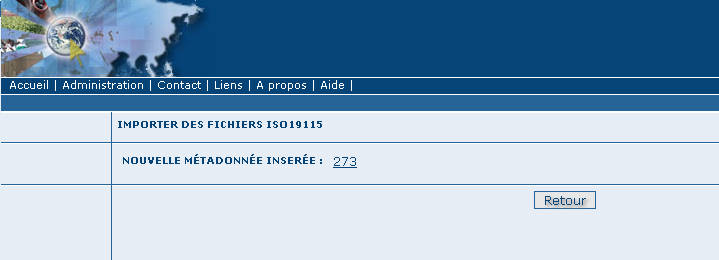

.. _`georchestra.documentation.utilisateur.catalogue.administrer`:

Administration d’une fiche
===========================

Une fois la fiche créée (ou importée), nous avons accès à un certain nombre 
d’actions :

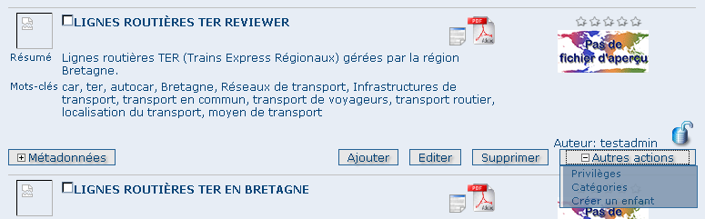

* **Ajouter :** duplique la fiche. On vous demandera de choisir le groupe où la 
  fiche dupliquée sera affectée. Elle apparaîtra avec les mêmes informations 
  que la fiche source.
* **Editer :** permet l’édition de la fiche de métadonnées.
* **Supprimer :** supprime la fiche de métadonnées.

Dans le menu *autres actions*, diverses actions sont possibles :

* privilèges ;
* catégorie ;
* créer enfant.

**Privilèges :**

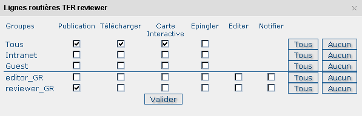

Par défaut, seuls les membres de votre groupe ont les droits de visualisation 
(publication). Pour satisfaire aux exigences du partenariat Geobretagne, les 
cases **publication**, **télécharger**, **carte interactive** (lien avec le 
visualiseur) doivent être cochées pour *Tous*.

* **Epingler :** épingler la fiche en page d’accueil (favori).
* **Editer :** donner les droits d’édition (seulement possible sur un autre 
  groupe, les membres du vôtre ont les droits d’édition par défaut).
* **Notifier :** Les membres du groupe seront avertis par mail si la fiche de 
  métadonnées a été téléchargée.

**Catégorie :**

Associer la fiche de métadonnée à la catégorie de donnée à laquelle elle fait 
référence.

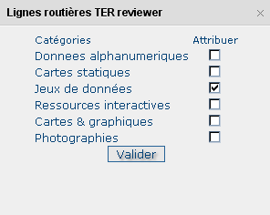

**Créer un enfant :**

On vous demandera le groupe dans lequel  vous voulez affecter la fiche enfant 
qui aura le même contenu que la fiche parent avec un lien en référence au parent.

.. _`georchestra.documentation.utilisateur.catalogue.majfiche`:

Mise à jour d’une fiche de métadonnée et de la donnée 
======================================================

Pour mettre à jour une fiche de métadonnée, il faut cliquez sur Editer dans 
l’encart de cette fiche. Le mode édition de la fiche apparaît à l’écran.

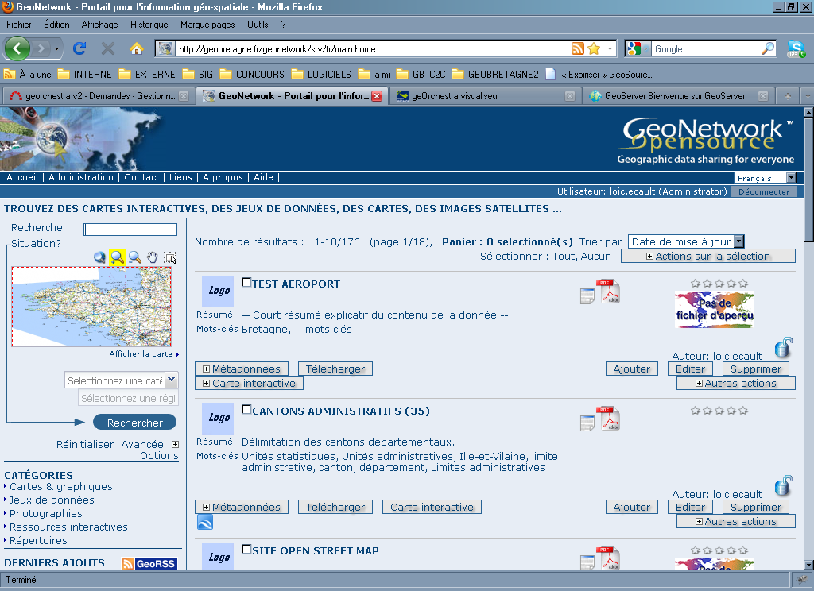

Pour mettre à jour la donnée, il faut allez dans l’encart Options de transfert 
puis cliquez sur Supprimer.

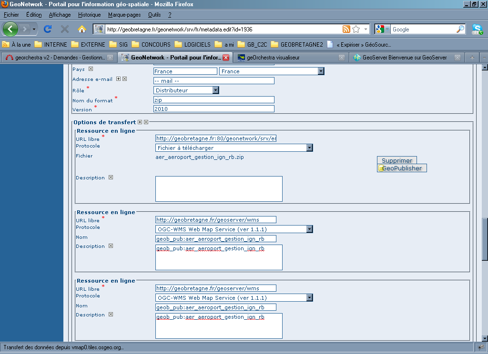

Une fois que l’on a fait cela, il suffit de reprendre la procédure de 
publication d’une donnée (voir page 6) et d’Enregistrer la fiche.

.. _`georchestra.documentation.utilisateur.catalogue.majdonnees`:

Mise à jour d’une donnée issue d’une métadonnée de la V1
=========================================================

En effet, la structure au niveau du téléchargement et de la publication OGC 
n’est pas la même si la donnée est issue de la V1 ou si elle a été nouvellement 
créée.

A voir soit :

* fournir la donnée à un admin geobretagne
* voir si c’est possible de télécharger la donnée (après la suppression par un 
  admin) puis de la télécharger. => avantage c’est qu’on devra avertir l’admin 
  qu’une fois)

