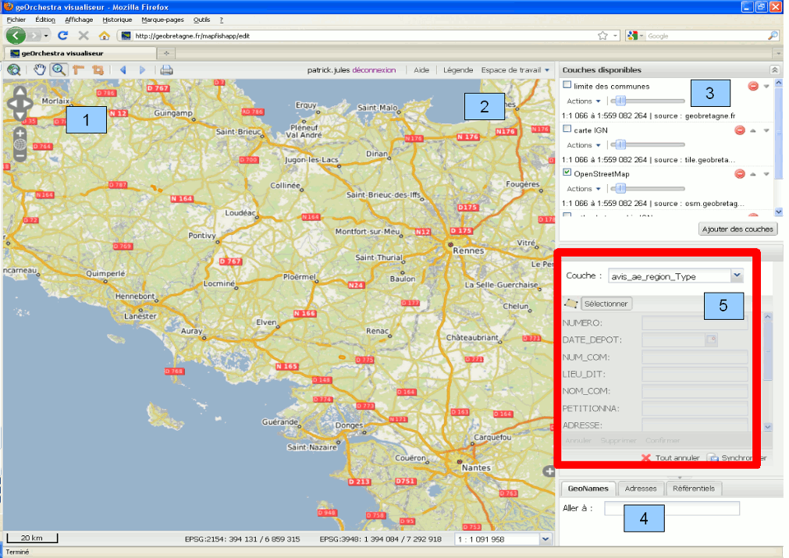
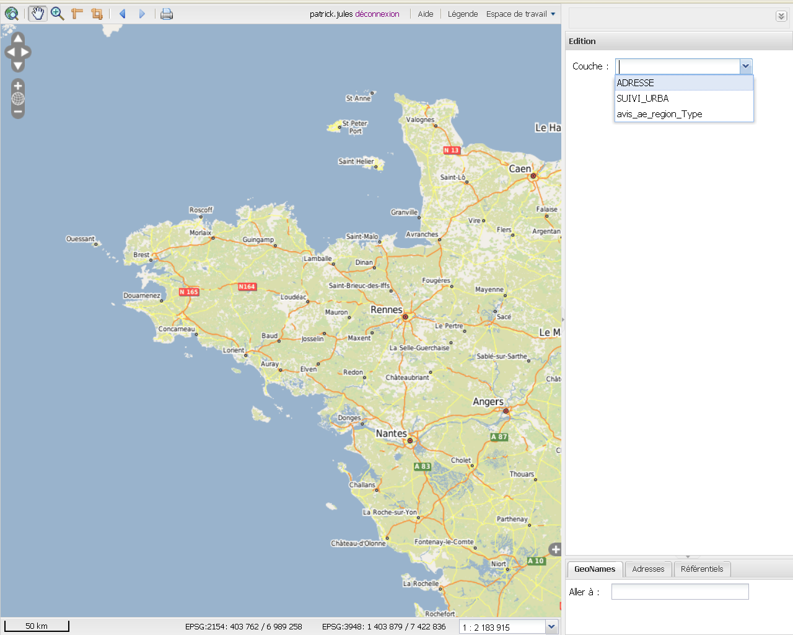
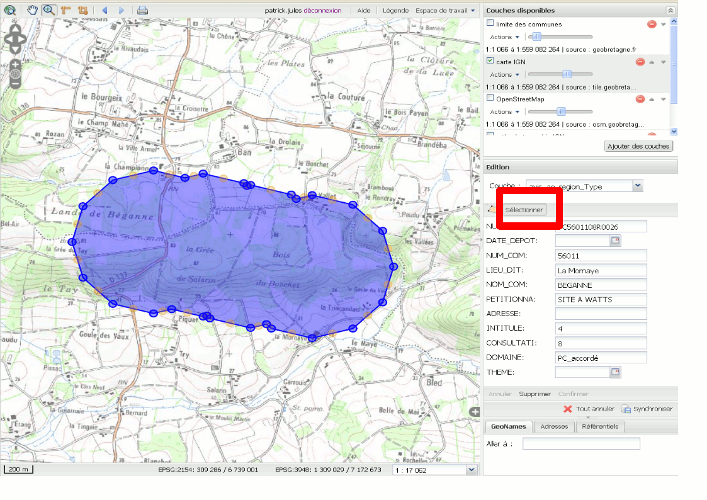
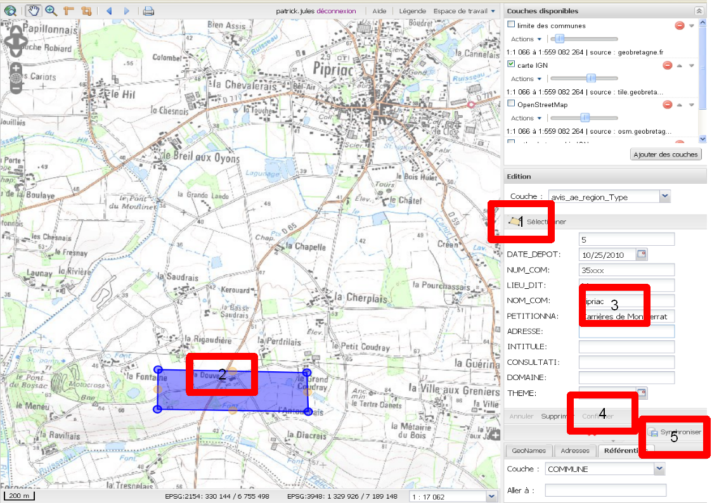

.. _`georchestra.documentation.utilisateur.edition`:

========================
Editeur – mode d’emploi
========================

:author: Lydie Vinsonneau
:author: Yves Jacolin

Introduction
============

Le module d'édition de geOrchestra permet l'édition des couches spatiales 
diffusées. L'accès est lié aux droits que l'utilisateur possède sur les couches.
Ainsi un utilisateur pourra éditer une couche ou non en fonction des droits au 
niveau du serveur.

Pour appréhender les potentialités de l'éditeur de geOrchestra, n’hésitez pas à 
cliquer sur la rubrique, parmi celles présentées qui vous intéresse :

 * :ref:`georchestra.documentation.utilisateur.edition.ergo`
 * :ref:`georchestra.documentation.utilisateur.edition.load`
 * :ref:`georchestra.documentation.utilisateur.edition.modif`
 * :ref:`georchestra.documentation.utilisateur.edition.saisie`

.. _`georchestra.documentation.utilisateur.edition.ergo`:

Ergonomie générale de l’interface
==================================

La capture d'écran ci-dessous présente l'ergonomie générale de l'interface.

**Légende :**

 * Zone 1 : Barre d'outils de zoom, de déplacement, de mesure et d’impression
 * Zone 2 : Légende et espace de travail d’enregistrement et de chargement des 
   WMC (Le standard WMC permet de sauvegarde l'état d'un projet dans un fichier 
   pour s'en servir plus tard ou l'envoyer à un collègue).
 * Zone 3 : Gestion des couches d’informations présentes (affichage, 
   transparence, etc.);
 * Zone 4 : Géolocalisation selon Geonames ;
 * Zone 5 : Édition proprement dite.

.. _`georchestra.documentation.utilisateur.edition.load`:

Charger une couche editable
============================

Pour charger une couche en mode édition, choissisez votre couche en haut à 
droite de la fenêtre :

La couche est alors chargée en mode édition.

.. _`georchestra.documentation.utilisateur.edition.modif`:

Modification d'un objet
=========================

Le bouton *Sélection* associé à une couche vous permet, après avoir cliqué sur 
un objet de cette couche de modifier cet objet.

En déplaçant les points d'accroche du polygone vous pouvez modifier l'objet (1).
Pour enregistrer, il est nécessaire de synchroniser (2).

.. image:: _static/edition_modification_objet2.png
    :width: 700px
    

.. _`georchestra.documentation.utilisateur.edition.saisie`:

Saisie d'un objet
==================

**Légende :**

 * Sélectionnez l'icone de saisie (1)
 * Saisie du polygone(2)
 * Saisie des valeurs(3)
 * Confirmation/suppression(4)
 * Synchronisation (5)
