.. _`georchestra.documentation.utilisateur.visualiseur`:

============================
Visualiseur – mode d’emploi
============================

:author: Lydie Vinsonneau

Introduction
============

Pour appréhender les potentialités du visualiseur de geOrchestra, n’hésitez pas à cliquer sur la rubrique, parmi celles présentées qui vous intéresse :

Ergonomie générale de l’interface
Barre d’outils zoom, mesure et impression
Présentation des couches
Ajouter une couche d’un serveur OGC distant
Styler une couche (rubrique en cours de création)
Requêter une couche (rubrique en cours de création)

Ergonomie générale de l’interface
====================================

La capture d'écran ci-dessous présente l'ergonomie de l'interface de visualisation 
de geOrchestra. Celle-ci laisse une grande part à la carte.

**Légende :**

 * Partie 1 : Outils de zoom, de déplacement, de mesure et d’impression ;
 * Partie 2 : Changement d’échelle ;
 * Partie 3 : Aide en ligne, légende et espace de travail d’enregistrement et de chargement des WMC ;
 * Partie 4 : Travail sur les couches d’informations présentes ;
 * Partie 5 : Géolocalisation grâce à Geonames, par référentiel ou par adresse ;
 * Partie 6 : Mode connecté.

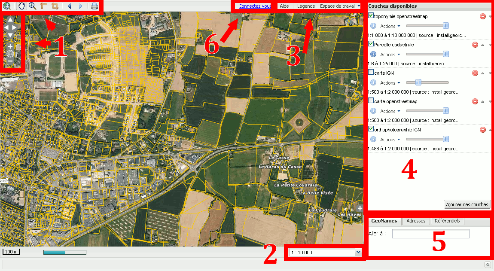

Barre d’outils zoom-mesure-impression
--------------------------------------

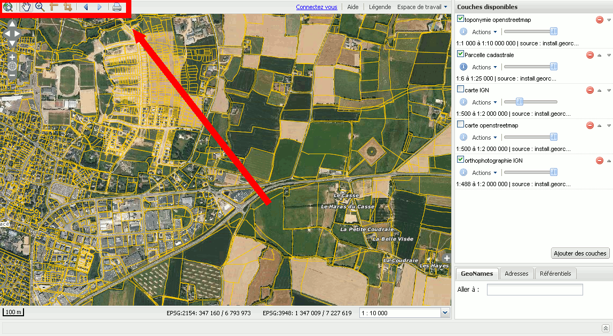

En haut à gauche de la fenêtre, vous trouverez les outils suivants :

 * |extend| Zoom sur la **vue globale** ;
 * |pan| **Glisser/déplacer** sur la carte en conservant la même échelle ;
 * |zoom| Zoom avant par clic souris ou rectangle ;
 * |distance| **Mesure d’une distance** ;
 * |surface| **Mesure d’une surface** ;
 * |history| Accéder au **zoom précédent ou suivant** ;
 * |print| **Imprimer** la carte.

.. note: :
    |zoombar| Les fonctionnalités de déplacement et de zoom plus classiquement utilisées dans les sites grand public se retrouvent en haut en dessous de la barre principale
    La **roulette de la souris** permet également de zoomer en avant et en arrière

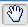
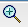
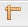

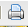

Changement d’échelle
---------------------

Les différentes échelles sont géré par l'utilisateur dans le cadre bas à droite 
par l'utilisateur :

.. image:: _static/visualiseur_scalebar.png
    :width: 700px

En déroulant le menu de changement d’échelle, vous pourrez choisir parmi les 
échelles définies pour le territoire :

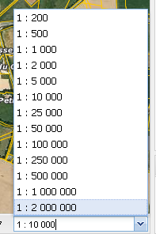

.. note::
    |scalebar_scale| À gauche de la barre d’échelle, vous trouverez les 
    coordonnées « souris » en Lambert 93 (EPSG : 2154) et en Lambert 2 étendu 
    (EPSG : 3948)

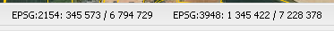

Présentation des couches
-------------------------

Cocher/Décocher pour faire **apparaître/disparaître une couche d’information** : 
|couche_activee| ou |couche_desactivee|

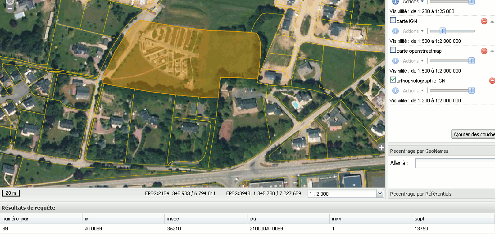
    
Le bouton |icone_info| associé à une couche vous permet, après avoir cliqué 
dans la vue sur un objet de cette couche de récupérer en bas de la fenêtre les 
**informations descriptives liées à l’objet**.

En déplaçant le curseur de la rampe associée à la couche, **vous pouvez jouer sur 
la transparence de celle-ci**.

.. image:: _static/visualiseur_couches_transparence.png
    :width: 700px
    
Pour **monter une couche au premier plan ou descendre une couche en arrière-plan**, 
utilisez les flèches à droite du nom de la couche

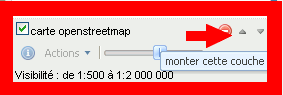

Ajout une couche d’un serveur OGC distant
==========================================

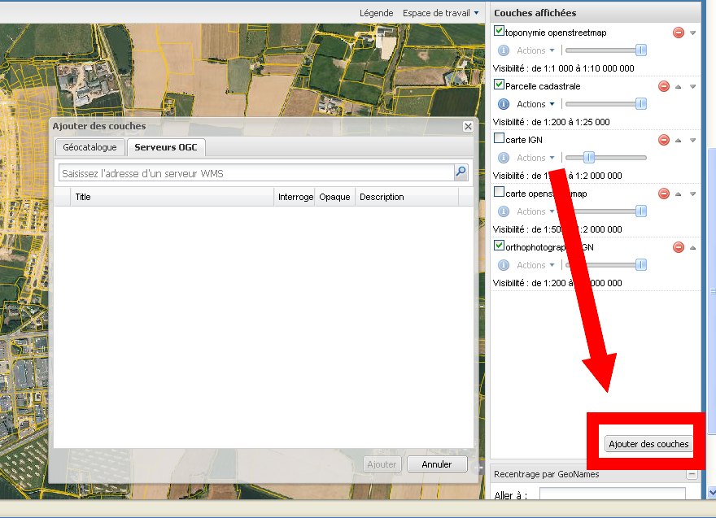

Pour **ajouter une couche d’un serveur OGC distant**, cliquer sur le bouton 
|ogcbouton|.

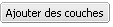

.. warning::
    Si le message suivant apparaît :
    
    .. image:: _static/visualiseur_addlayer_erreur.png
    
    **Cliquez sur OK** pour continuer normalement

Cliquer sur l’onglet Serveurs OGC et **renseigner l’URL du serveur OGC** par exemple 
le serveur du Géolittoral : http://geolittoral.application.equipement.gouv.fr/wms/metropole? :

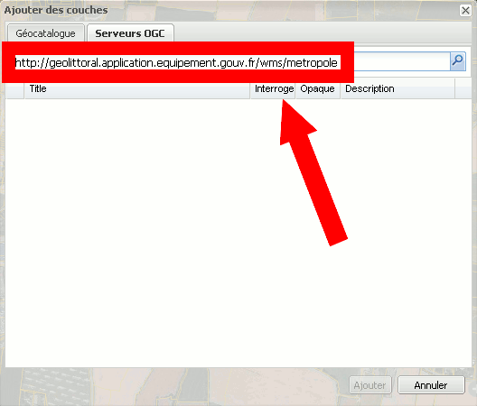

Vous pouvez ensuite **sélectionner les couches disponibles** qui vous intéressent 
de superposer dans le visualiseur aux autres couches :

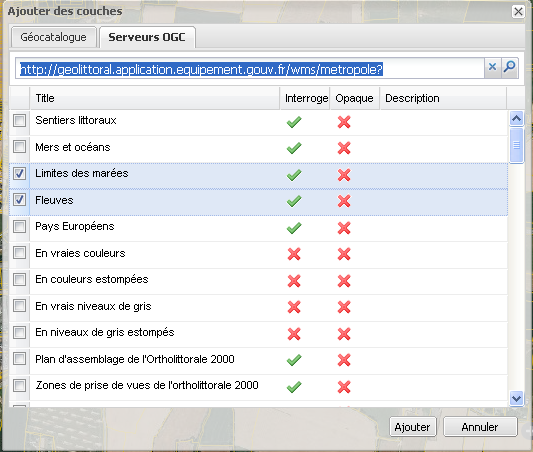

Cliquer sur  Les couches apparaissent alors dans le visualiseur comme 
ci-dessous :

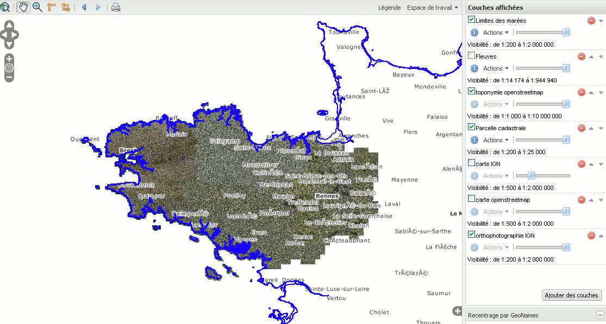
    
Styler une couche
==================

Nous allons montrer dans l’exemple ci-dessous, comment styler en rouge toutes 
les parcelles cadastrales < 500 m²

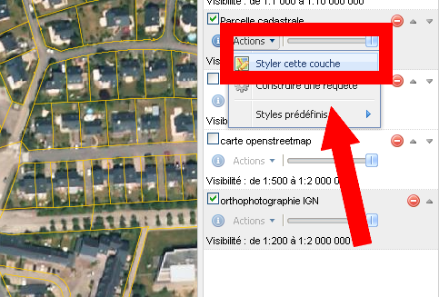
    
Allez cliquer sur le bouton |actionStyler| de la couche « Parcelle cadastrale »
Choisissez |stylerStyler|.

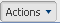
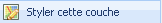

Requêter une couche
====================

