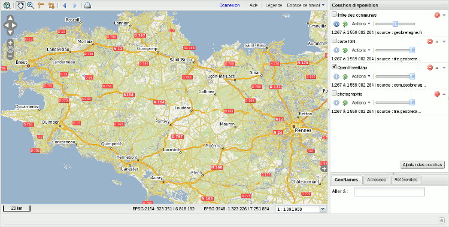
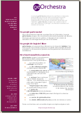

.. geOrchestra website master file, created by
   sphinx-quickstart on Mon Sep 21 16:47:05 2009.
   You can adapt this file completely to your liking, but it should at least
   contain the root `toctree` directive.
.. http://www.source-gratuit.com/349-telecharger-template-gratuit-Delivering.html
.. http://www.source-gratuit.com/479-telecharger-template-gratuit-Corporate-Ltd.html
        
.. _`georchestra.index`:

=============
geOrchestra
=============

Le projet geOrchestra a pour objectif de développer une Infrastructure de 
Données Spatiales **modulaire**, **interopérable** et **libre**, en se basant sur 
les meilleurs composants cartographiques disponibles.

Référencé par l'Adullact_, geOrchestra propose une solution clef en
main pour publier et partager vos données localisées sur
intranet et internet. 

Pour une présentation visuelle de la solution geOrchestra et de ses composants, nous vous 
invitons à consulter cet :ref:`georchestra.documentation.overview`. Vous pouvez également regarder la 
:ref:`georchestra.documentation.fiche_identite` pour avoir une connaissance des fonctionnalités 
offertes dans geOrchestra.

Vous pouvez trouver de l’aide grâce à la liste de diffusion communautaire : voir la section Communauté.

Enfin tenez vous au courant des évolutions du projet via 
`le blog <http://blog.georchestra.org>`_ et le compte `Twitter <https://twitter.com/#!/georchestra>`_ dédié.

Fonctionnalités principales
===========================

Le projet geOrchestra est bâti autour d'une suite de modules complètement indépendants et interopérables :

* un catalogue, muni d'une fonction permettant de géo-publier des couches cartographiques,
* un visualiseur et éditeur,
* un extracteur,
* un serveur cartographique,
* un site éditorial.

Ces différents modules sont faiblement couplés, ce qui signifie que le 
fonctionnement de chaque module n'affecte pas les autres. La communication 
entre modules utilise les standards de l'OGC.

Une réponse efficace à la directive INSPIRE
===========================================

   
geOrchestra a été conçu pour répondre aux exigences de la `directive INSPIRE <http://inspire.jrc.ec.europa.eu/>`_, 
qui vise à établir une infrastructure de données géographiques à l'échelle Européenne, dans l'objectif de répondre 
aux enjeux du développement durable :

* services de découverte, de visualisation et de téléchargement des données géographiques,
* lien permanent entre la donnée géographique et sa métadonnée,
* respect des normes et standards prônés par INSPIRE (cf. ci-dessous),
* outils d'administration facilitant la prise en compte d'INSPIRE (thèmes INSPIRE 
pré-enregistrés, thesaurus gemet, évaluation de la conformité INSPIRE, etc),
* une réutilisation facilitée des données grâce à la mise à disposition de services web.

Implémentation des standards
=============================

geOrchestra repose sur les standards de l'OGC, notamment :

* `WMS <http://www.opengeospatial.org/standards/wms>`_ : Web Map Service
* `WMTS <http://www.opengeospatial.org/standards/wmts>`_ : Web Map Tile Service
* `WFS <http://www.opengeospatial.org/standards/wfs>`_ : Web Feature Service (dont transactionnel)
* `WCS <http://www.opengeospatial.org/standards/wcs>`_ : Web Coverage Service
* `WMC <http://www.opengeospatial.org/standards/wmc>`_ : Web Map Context
* `SLD <http://www.opengeospatial.org/standards/sld>`_ : Styled Layer Descriptor
* `FE <http://www.opengeospatial.org/standards/filter>`_ : Filter Encoding
* `CSW <http://www.opengeospatial.org/standards/cat>`_ : Catalog Service

Une communauté d'utilisateurs et de développeurs
================================================

Le projet est supporté par une communauté croissante de développeurs et d'utilisateurs enthousiastes.

Plusieurs sociétés fournissent également un support commercial :

* `Camptocamp <http://camptocamp.com>`_ : société de service en logiciel libre, basée à Chambéry, est concepteur de la solution dans le cadre 
  du projet `GeoBretagne <http://geobretagne.fr>`_. Camptocamp propose des offres d'intégration de l'IDS au sein de votre infrastructure, du support, mais également des prestations de développement sur mesure et des formations (utilisateurs, administrateur système et administrateur de données).
* `DotGee <http://www.dotgee.fr/#>`_ : société basée à Rennes, offre également des prestations de support et développement sur mesure autour de l'IDS.

.. toctree::
   :maxdepth: 2
   :hidden:
   
   documentation/index
   community
   download
   about

.. _Adullact: https://adullact.net/projects/georchestra/

